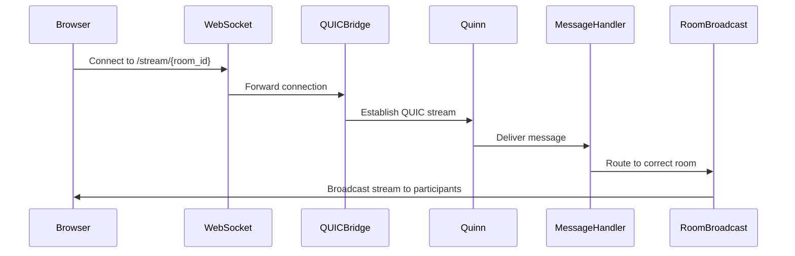

lays out a WebSocket-based room system with QUIC under the hood, message routing, and room broadcasting


1. Use a QUIC library (like quinn) for the underlying transport.
2. U se a WebSocket library (like tokio-tungstenite) for the WebSocket protocol.
3. Implement a room manager to handle rooms and broadcasting.
4. Route messages from clients to the correct room and broadcast to all room members.

# COnnection Flow


# Getting Started

## Prerequisites
- Rust (latest stable, install from https://rustup.rs)
- `cargo` (comes with Rust)

## Build the Project

```bash
cargo build --release
```

## Run the Server

```bash
cargo run --release
```

The server will start and listen on `0.0.0.0:5000` using QUIC with self-signed certificates.

## Run the Client (in a separate terminal)

```bash
cargo run --release --bin client
```

You can type messages in the client terminal. To exit, type `/quit`.

## Notes
- The first run will generate self-signed certificates (`cert.der` and `key.der`) in the project directory.
- The server and client communicate over QUIC and WebSocket, with room-based message routing and broadcasting.